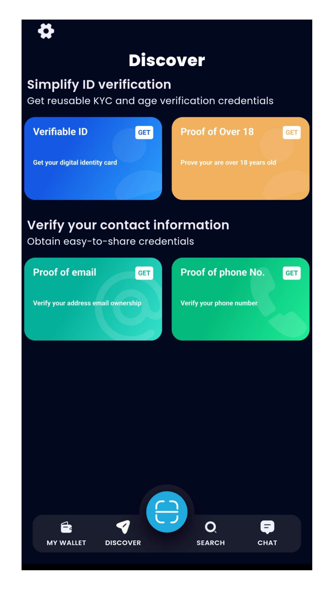
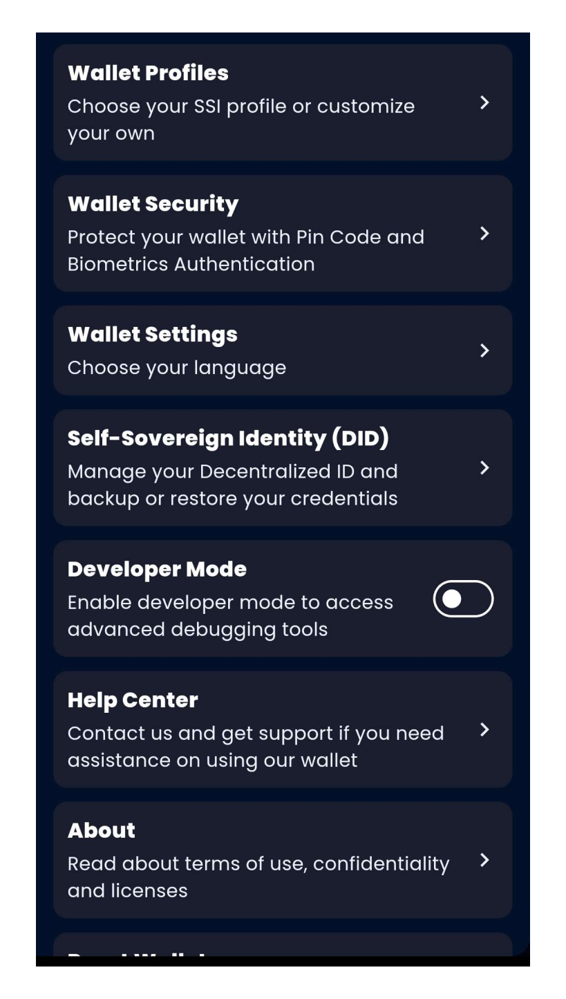

# Navigating the Talao App

   
Home Screen

    
   - **Discover**: Overview of your digital identities and assets.
   - **Wallet**: Access and manage your digital assets.
   - **Search**: Search a card from the Discover part.
   - **Chat**: Chat to support if you need any help.

   

   
Menu

    
   - **Wallet profiles**: Choose your SSI profile or customize yor own (DIIP, EBSI, OWF, HAIP, Custom).
   - **Wallet Security**: To secure your wallet and show your wallet recovery phrase.
   - **Wallet Settings**: Choose your language.
   - **SSI (DID)**: Manage your decentralized ID and backup or restore your credentials.
   - **Developer Mode**: To acces advanced debugging tools.
   - **Help center**: Contact Support, FAQs, website.
   - **About**: App version, Terms of Use & Confidentiality and Software Licenses.
   - **Reset Wallet**: To reset your wallet.

   

   
Configuring the Talao App using Wallet Provider

    
   1. **Access Configuration**: 
   - Go to the Wallet Provider portal.
   - Navigate to your wallet configuration.
   - Find the QR code generated for your wallet configuration.

   2. **Scan QR Code**:
      - Open the **Talao** app.
      - Go to the **Settings** menu.
      - Tap on **Configure Wallet**.
      - Use the built-in QR code scanner to scan the configuration QR code provided by the Wallet Provider.

   3. **Apply Configuration**:
      - The app will automatically apply the configuration settings.
      - This includes setting up the wallet type, DID methods, verifiable credential formats, and other custom settings.

