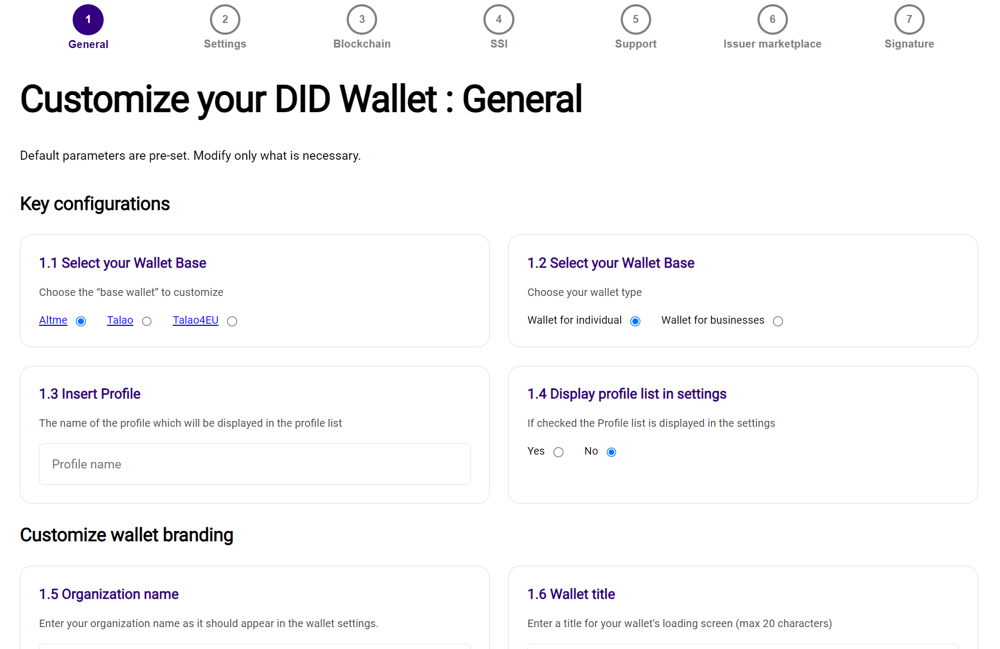
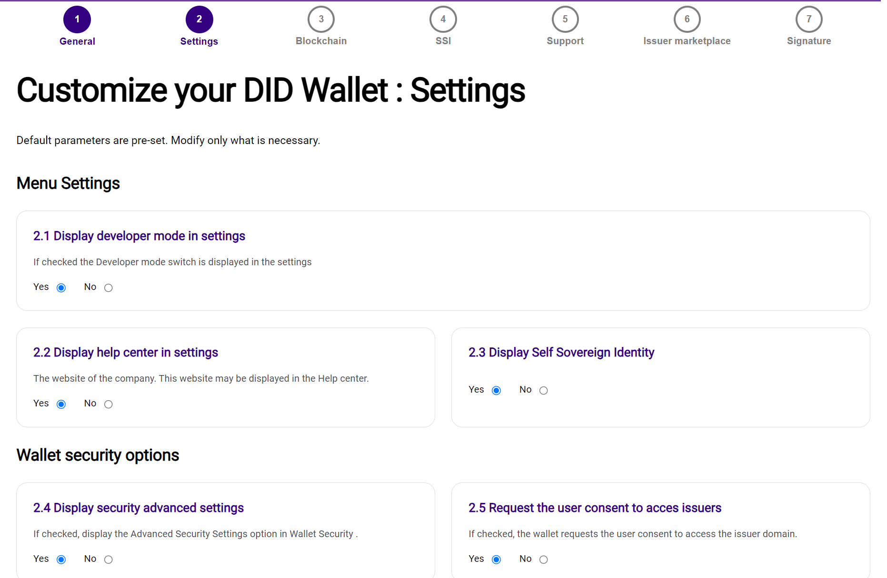
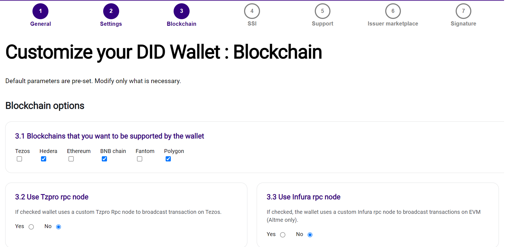
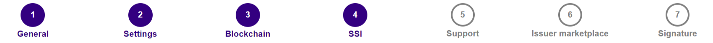
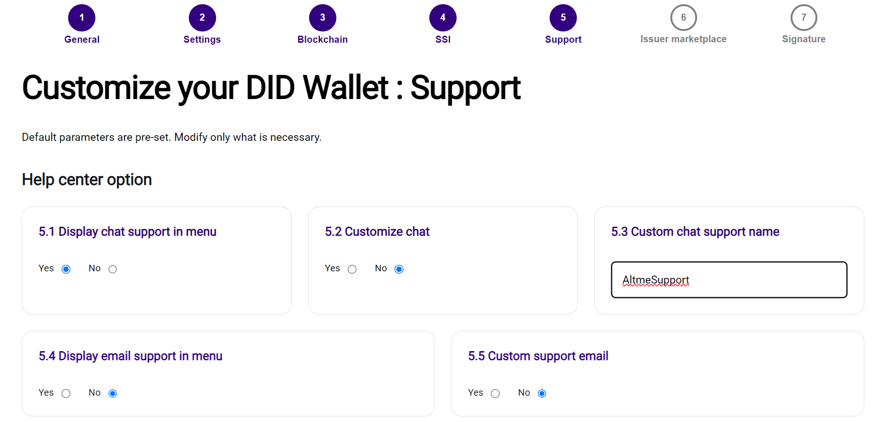
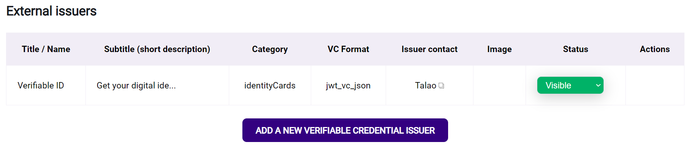
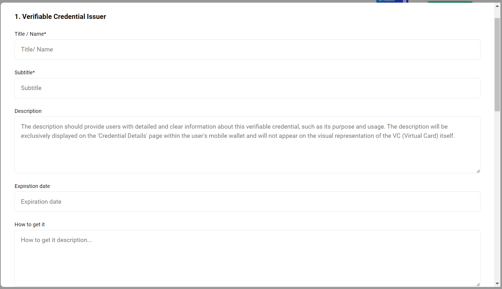
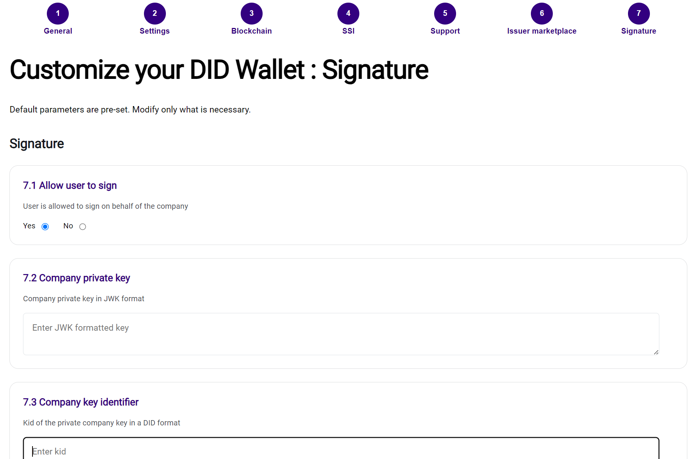

# Setting Up the Talao App with Wallet Provider 

This guide provides detailed instructions for setting up and configuring the Talao app using the Wallet Provider platform. Follow these steps to get your Talao app ready for deployment.

## Prerequisites

    Before you begin, ensure you have the following:
        - Access to the Wallet Provider platform
        - Necessary credentials for the Wallet Provider
        - Basic understanding of web development and deployment processes

    
Step 1: Access Wallet Provider

    
    1. Navigate to the [Wallet Provider platform](https://wallet-provider.talao.co/).
    2. Log in using your credentials.

    
Step 2: Configure General Options

    
    1. Go to the **General Options** section.
    2. Set the following configurations:
        - **Wallet Type**: Select `altme`.
        - **Wallet For**: Select the appropriate option for your use case. For Talao app, select `np` if applicable.
        - **Company Name**: Enter your company name.
        - **Company Website**: Enter your company’s website URL.
        - **Company Logo**: Upload your company logo.
        - **Tag Line**: Enter a tagline for your wallet.
        - **Splash Screen Title**: Enter a title for the splash screen.
        - **Profile Name**: Enter a name for your wallet profile.
        - **Profile Version**: Enter the version of your wallet profile.
        - **Published**: Enter the publication date of your wallet profile.
        - **Profile ID**: Enter the profile ID.
        - **Customer Plan**: Select your customer plan.
        - **Organization Status**: Set the status of your organization.

    

    
Step 3: Configure Settings Menu

    
    1. Go to the **Settings Menu** section.
    2. Configure the following options based on your requirements:
        - **Display Profile**: Set to `true` or `false`.
        - **Display Developer Mode**: Set to `true` or `false`.
        - **Display Help Center**: Set to `true` or `false`.
        - **Display Self Sovereign Identity**: Set to `true` or `false`.

    

    
Step 4: Configure Blockchain Options

    
    1. Go to the **Blockchain Options** section.
    2. Configure the following options:
        - **Tezos Support**: Set to `true` or `false`.
        - **Ethereum Support**: Set to `true` or `false`.
        - **Hedera Support**: Set to `true` or `false`.
        - **BNB Support**: Set to `true` or `false`.
        - **Fantom Support**: Set to `true` or `false`.
        - **Polygon Support**: Set to `true` or `false`.
        - **TZPro RPC Node**: Set to `true` or `false`.
        - **TZPro API Key**: Enter the API key.
        - **Infura RPC Node**: Set to `true` or `false`.
        - **Infura API Key**: Enter the API key.

    

    
Step 5: Configure Self-Sovereign Identity Options

    
    1. Go to the **Self-Sovereign Identity Options** section.
    2. Configure the following options:
        - **Display Manage Decentralized ID**: Set to `true` or `false`.
        - **Display SSI Advanced Settings**: Set to `true` or `false`.
        - **Display Verifiable Data Registry**: Set to `true` or `false`.
        - **OIDV4VC Profile**: Enter the OIDV4VC profile details.
        - **Custom OIDC4VC Profile**: Configure the custom profile:
            - **VC Format**: Set the VC format.
            - **Proof Header**: Set the proof header.
            - **Proof Type**: Set the proof type.
            - **Status List Cache**: Set to `true` or `false`.
            - **Security Level**: Set to `true` or `false`.
            - **Client Authentication**: Set the client authentication method.
            - **Credential Manifest Support**: Set to `true` or `false`.
            - **User PIN Digits**: Enter the number of user PIN digits.
            - **Default DID**: Enter the default DID.
            - **Subject Syntax Type**: Enter the subject syntax type.
            - **Crypto Holder Binding**: Set to `true` or `false`.
            - **Scope**: Set the scope.
            - **Client ID**: Enter the client ID.
            - **Client Secret**: Enter the client secret.
            - **OIDC4VCI Draft**: Enter the OIDC4VCI draft version.
            - **OIDC4VP Draft**: Enter the OIDC4VP draft version.
            - **SIOP V2 Draft**: Enter the SIOP V2 draft version.
            - **Push Authorization Request**: Set to `true` or `false`.

    

    
Step 6: Support

    
    1. Go to the **Help Center Options** section.
    2. Configure the following options:
        - **Is Chat**: Set to `true` or `false`.
        - **Display Chat Support**: Set to `true` or `false`.
        - **Custom Chat Support**: Set to `true` or `false`.
        - **Custom Chat Support Name**: Enter the custom chat support name.
        - **Display Email Support**: Set to `true` or `false`.
        - **Custom Email Support**: Set to `true` or `false`.
        - **Custom Email**: Enter the custom email.

    

    
Step 7: Issuer marketplace

    
    1. Go to the **Discover Cards Options** section.
    2. Configure the following options based on your enterprise requirements:
        - **Display Rewards Category**: Set to `true` or `false`.
        - **Display Over 18**: Set to `true` or `false`.
        - **Display Over 18 JWT**: Set to `true` or `false`.
        - **Display Over 13**: Set to `true` or `false`.
        - **Display Over 15**: Set to `true` or `false`.
        - **Display Over 21**: Set to `true` or `false`.
        - **Display Over 50**: Set to `true` or `false`.
        - **Display Over 65**: Set to `true` or `false`.
        - **Display Email Pass**: Set to `true` or `false`.
        - **Display Email Pass JWT**: Set to `true` or `false`.
        - **Display Phone Pass**: Set to `true` or `false`.
        - **Display Phone Pass JWT**: Set to `true` or `false`.
        - **Display Age Range**: Set to `true` or `false`.
        - **Display Gender**: Set to `true` or `false`.
        - **Display Verifiable ID**: Set to `true` or `false`.
        - **Display Verifiable ID JWT**: Set to `true` or `false`.
        - **Display Verifiable ID SD-JWT**: Set to `true` or `false`.
        - **Display Humanity**: Set to `true` or `false`.
        - **Display Humanity JWT**: Set to `true` or `false`.
        - **Display DeFi**: Set to `true` or `false`.
        - **Display Chainborn**: Set to `true` or `false`.
        - **Display Tezotopia**: Set to `true` or `false`.
        

        - **Display External Issuer**: List any external issuers.
        

    3. Add your own external issuers:
        

    
Step 8: Configure Company Signature

    
    1. Go to the **Company Signature** section.
    2. Set the following options:
        - **Is Allowed**: Set to `true` or `false`.
        - **KID**: Enter the Key ID.
        - **Company Key**: Enter the company key.
        - **Company KID**: Enter the company KID.

    

    
Step 9: Save and Deploy

    
    1. Once all configurations are set, save your settings.
    2. Deploy the configuration to the Wallet Provider.
    3. Ensure the configurations are correctly applied to your Talao app.

## Purpose of Different Configurations

## Overview & Examples
    
    The Talao app supports multiple configurations to cater to different use cases and user needs. Below are the purposes of the different configurations available:

    ### 1. **DIIP (Decentralized Identity Integration Profile)**
    - **Purpose**: Designed for integrating decentralized identity solutions seamlessly into existing systems.
    - **Use Case**: Ideal for organizations looking to implement DID-based identity verification and credential issuance.

    ### 2. **EBSI (European Blockchain Services Infrastructure)**
    - **Purpose**: Complies with the European standards for blockchain services and digital identities.
    - **Use Case**: Suitable for organizations operating within the EU and needing compliance with EBSI standards.

    ### 3. **HAIP (Health Authentication and Identification Profile)**
    - **Purpose**: Focused on the healthcare sector, providing secure and verifiable health credentials.
    - **Use Case**: Perfect for healthcare providers needing to issue and verify health-related credentials securely.

    ### 4. **OWF (Open Wallet Foundation)**
    - **Purpose**: Supports a wide range of open wallet standards for interoperability.
    - **Use Case**: Best for organizations requiring a flexible and interoperable wallet solution that adheres to open standards.

