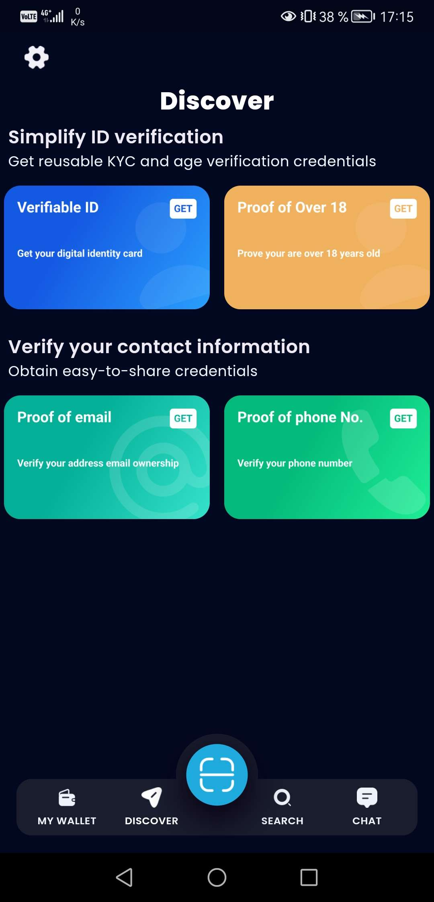
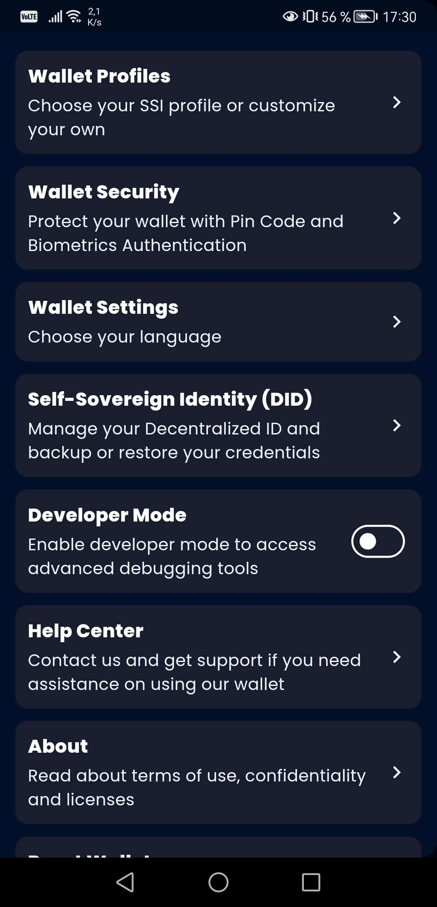

# How to Use the Talao App

## Introduction
The Talao app allows users to manage digital identities and assets seamlessly. This guide will walk you through the steps to download, install, and configure the Talao app using the Wallet Provider's configuration.

## Download and Install the Talao App

### iOS Users
1. Open the **App Store** on your iPhone.
2. Search for **"Talao"**.
3. Tap the **Download** button and install the app.

### Android Users
1. Open the **Google Play Store** on your Android device.
2. Search for **"Talao"**.
3. Tap the **Install** button and install the app.

## Logging into the Talao App

1. Open the **Talao** app on your device.
2. If you already have an account
    - On the login screen, enter your **email** and **password**.
    - Tap the **Login** button.
3. If you don't have an account
    - Create an account
    - Select your security method ( PIN, thumb-unlocking, both )
    - Accept terms

## Navigating the Talao App

### Home Screen
- **Discover**: Overview of your digital identities and assets.
- **Wallet**: Access and manage your digital assets.
- **Search**: Search a card from the Discover part.
- **Chat**: Chat to support if you need any help.

### Menu
- **Wallet profiles**: Choose your SSI profile or customize yor own (DIIP, EBSI, OWF, HAIP, Custom).
- **Wallet Security**: To secure your wallet and show your wallet recovery phrase.
- **Wallet Settings**: Choose your language.
- **SSI (DID)**: Manage your decentralized ID and backup or restore your credentials.
- **Developer Mode**: To acces advanced debugging tools.
- **Help center**: Contact Support, FAQs, website.
- **About**: App version, Terms of Use & Confidentiality and Software Licenses.
- **Reset Wallet**: To reset your wallet.

## Configuring the Talao App using Wallet Provider

1. **Access Configuration**: 
   - Go to the Wallet Provider portal.
   - Navigate to your wallet configuration.
   - Find the QR code generated for your wallet configuration.

2. **Scan QR Code**:
   - Open the **Talao** app.
   - Go to the **Settings** menu.
   - Tap on **Configure Wallet**.
   - Use the built-in QR code scanner to scan the configuration QR code provided by the Wallet Provider.

3. **Apply Configuration**:
   - The app will automatically apply the configuration settings.
   - This includes setting up the wallet type, DID methods, verifiable credential formats, and other custom settings.

## Managing Digital Identities and Assets

### Digital Identities
- **Create Identity**: Use the app to create and manage decentralized identities (DIDs).
- **Issue Credentials**: Receive verifiable credentials from trusted issuers directly in the app.
- **Share Credentials**: Share your credentials securely using QR codes or links.

### Digital Assets
- **View Assets**: Access your digital assets such as tokens and NFTs.
- **Transfer Assets**: Send and receive digital assets securely within the app.
- **Track Transactions**: Monitor your transaction history and status.

## Support and Troubleshooting

### Common Issues
- **Login Problems**: Ensure your email and password are correct. Use the **Forgot Password** option if necessary.
- **Configuration Issues**: Double-check the QR code scan and ensure your Wallet Provider configuration is correct.
- **App Crashes**: Restart the app or reinstall it from the App Store/Google Play Store.

### Contact Support
- **Email**: [contact@altme.io](mailto:contact@altme.io)
- **Help Center**: Access the help center through the app’s **Help** menu.
